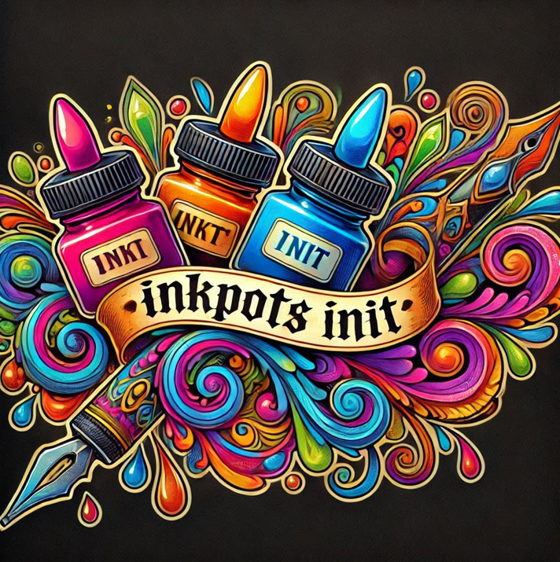
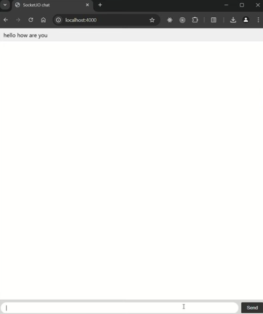

# Emily Halley 20092335 Final Year Project Semester 1

Name: Emily Halley - 20092335

Youtube Link: [https://youtu.be/jeCPitrpb80](https://youtu.be/HBCfquP-qGE)

## Overview.

The objective of my final year project is to create a comprehensive design to enhance the UX and UI for a tattoo studio located in Waterford called Inkpots in relation to its online presence and client engagement.  

Tattoos have a rich history, dating back thousands of years, serving as a form of personal expression, cultural significance, and art using many different forms of techniques and methods for inserting inks into a fixed place on the body.  

Despite their popularity, many studios face the common issue of not having a proper online presence. If they do, it’s often an outdated WordPress or Wix website that is broken, insecure, and not visually pleasing or easy to navigate, or they rely on social media sites such as Facebook, Instagram, or WhatsApp. This makes it difficult for clients to find reliable information about the studio, view artists’ portfolios, and get in touch with the studio and their favourite tattoo artist.  

As a developer, I want to help a tattoo studio improve its online presence, much like a web solutions company would, enabling them to move away from relying solely on outdated websites or social media platforms. It targets towards studios operating on a budget, ensuring that cost-effective advanced technologies solutions are included keeping up the studios work quality. Thereby, This project involves creating a modern, centralized web application that enhances the studio’s online presence and client engagement using the latest technologies. 

### Outline any non-standard setup steps necessary to run your app locally after cloning the repo.
1. Clone the repository:
   git clone https://github.com/emily172/FYP-SSD.git
   
2. <ins>Tattoo Site</ins>

 + cd tattoo-inkpots
 
 + Install dependencies: npm install
 
 + npm start

3. <ins>Chat Application</ins>

 + cd chat-application
 
 + Install dependencies: npm install
 
 + nodemon index.js

